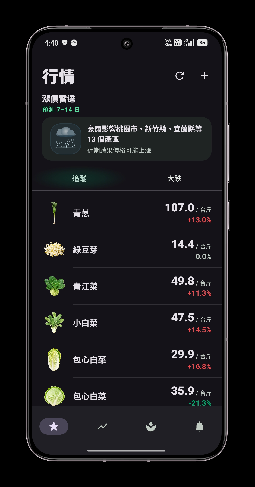
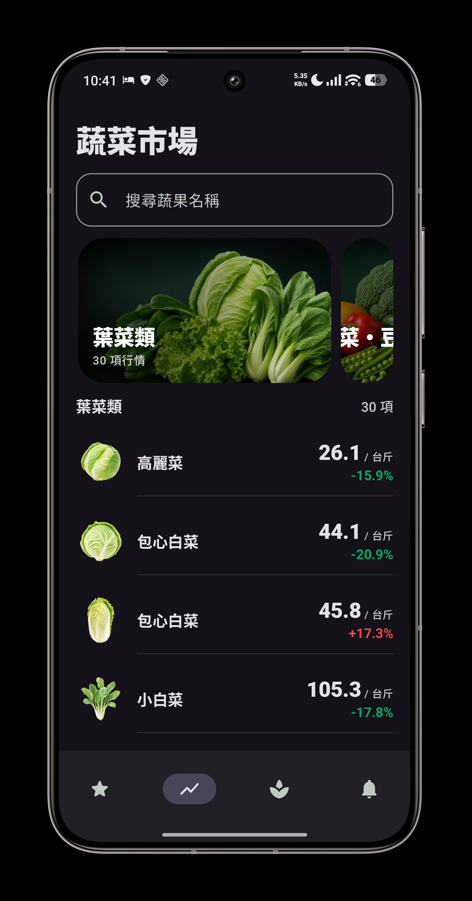
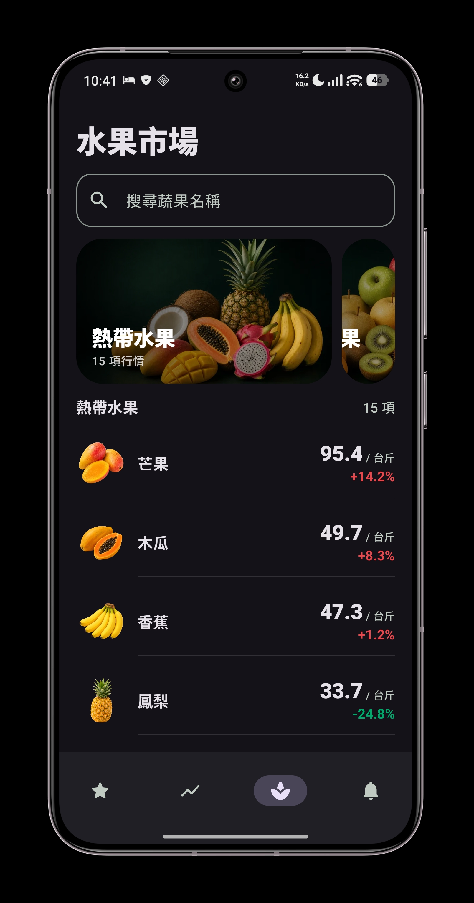
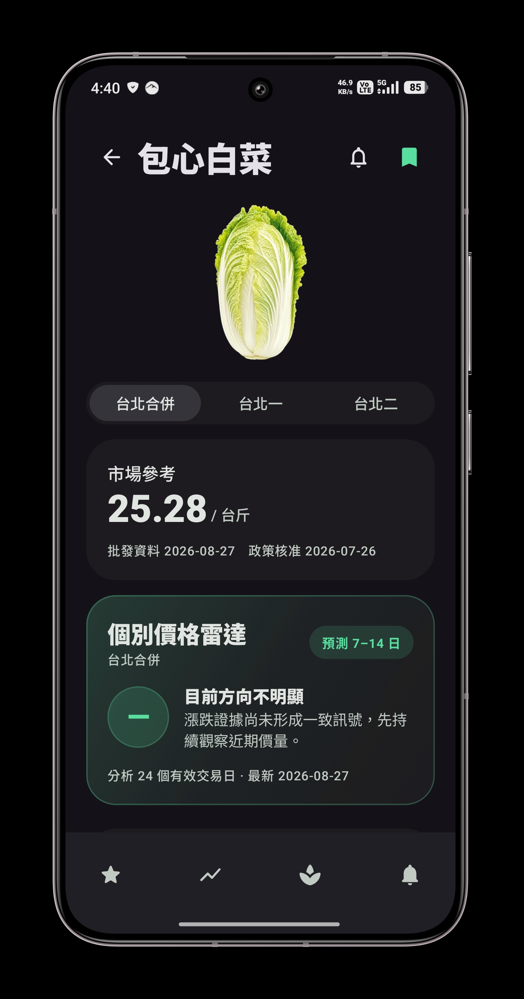
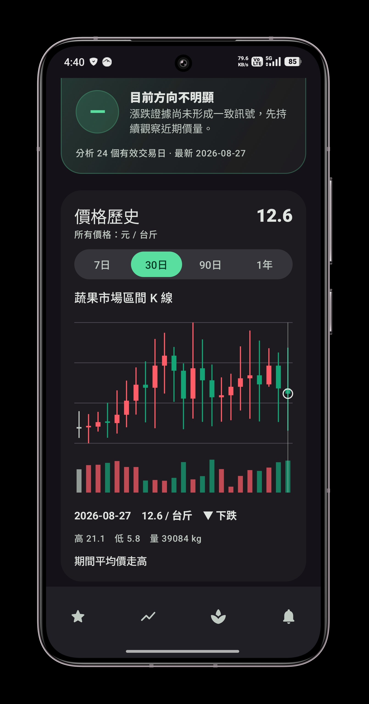

# 台北蔬果價

出門買菜前，想知道高麗菜今天大概多少錢、最近是不是變貴了？

台北蔬果價是一款 Android App，把台北果菜市場每天的批發行情整理成一眼看得懂的價格，幫你決定今天買什麼、要不要等幾天再買。

| 行情首頁 | 蔬菜市場 | 水果市場 |
| --- | --- | --- |
|  |  |  |

| 品項詳情 | 價格歷史 |
| --- | --- |
|  |  |

## 你可以用它做什麼

- **看常買的菜現在多少錢**：把常買的品項加入追蹤，打開首頁就能看到價格和漲跌。
- **用平常的叫法找菜**：搜尋「高麗菜」「地瓜葉」就找得到，也能按分類瀏覽蔬菜和水果。
- **知道接下來可能漲還是跌**：根據近期價格、到貨量和產地天氣，提示未來 7–14 天價格可能轉強、轉弱，或還看不出方向。
- **颱風、寒流來之前先知道**：產地出現天氣警示時，首頁會提醒哪些品項可能受影響。
- **降價時通知你**：設定一個價格，低於它時手機會提醒你。
- **沒網路也能看**：會保留上次更新的行情，並清楚標示資料日期。

## 價格怎麼來的

價格來自農業部公開的每日批發行情，預設合併台北一、台北二兩個果菜市場的資料，並換算成買菜時習慣的「元／台斤」。

App 裡的「市場參考價」是用批發價推估的零售價，方便你和菜市場、超市的價格比較：

```text
批發均價（元／公斤）× 0.6 × 2
```

資料來源：

- [農業部農產品交易行情](https://data.gov.tw/dataset/8066)
- [農業部作物目錄](https://data.moa.gov.tw/api/v1/CropType)
- [臺北市公有零售市場行情](https://data.taipei/dataset/detail?id=54d9d492-1e2e-40d1-ae7b-fbce6f271bf1)（用於校準參考價）
- [交通部中央氣象署開放資料](https://opendata.cwa.gov.tw/)

## 隱私

不需要註冊帳號，沒有廣告，也不追蹤你的使用行為。追蹤清單和提醒設定只存在你的手機裡，App 只會連到上面列出的政府開放資料來源。詳見 [PRIVACY_AND_ATTRIBUTION.md](PRIVACY_AND_ATTRIBUTION.md)。

本專案為個人獨立開發，與農業部、臺北市政府等政府機關無關。

## 開發者

### 環境

- Android Studio、JDK 17、Android SDK 36（minSdk 26）
- 天氣提醒需要中央氣象署 API key，請在 `local.properties` 設定 `CWA_API_KEY`，不要提交到 Git。沒有 key 也能編譯，只是不會有天氣提醒。

### 常用指令

```powershell
# 編譯 Debug
.\gradlew.bat :app:assembleDebug

# 單元測試
.\gradlew.bat test

# 格式、Lint 與測試
.\gradlew.bat verifyFormatting staticAnalysis test

# 建立並驗證 Release APK
.\gradlew.bat --dependency-verification=strict verifyFormatting staticAnalysis test :app:validateReleaseArtifact
```

Instrumentation tests 需要模擬器或實機。發行流程見 [RELEASE_RUNBOOK.md](RELEASE_RUNBOOK.md)。

### 模組

使用 Kotlin、Jetpack Compose、Material 3、Hilt、Room、Retrofit、WorkManager。

| 模組 | 內容 |
| --- | --- |
| `app` | 入口、導覽、依賴注入 |
| `home` | 首頁、追蹤清單、漲價雷達 |
| `catalog` | 蔬果目錄、搜尋、分類 |
| `detail` | 品項詳情、價格歷史 |
| `alerts` | 降價提醒 |
| `design-system` | 主題與共用元件 |
| `domain` | 估算、趨勢與提醒邏輯（純 Kotlin） |
| `data` | 資料下載、本機快取、背景同步 |
| `release-tool` | 目錄與模型的發行檢查 |

目前版本 `0.1.0`。
